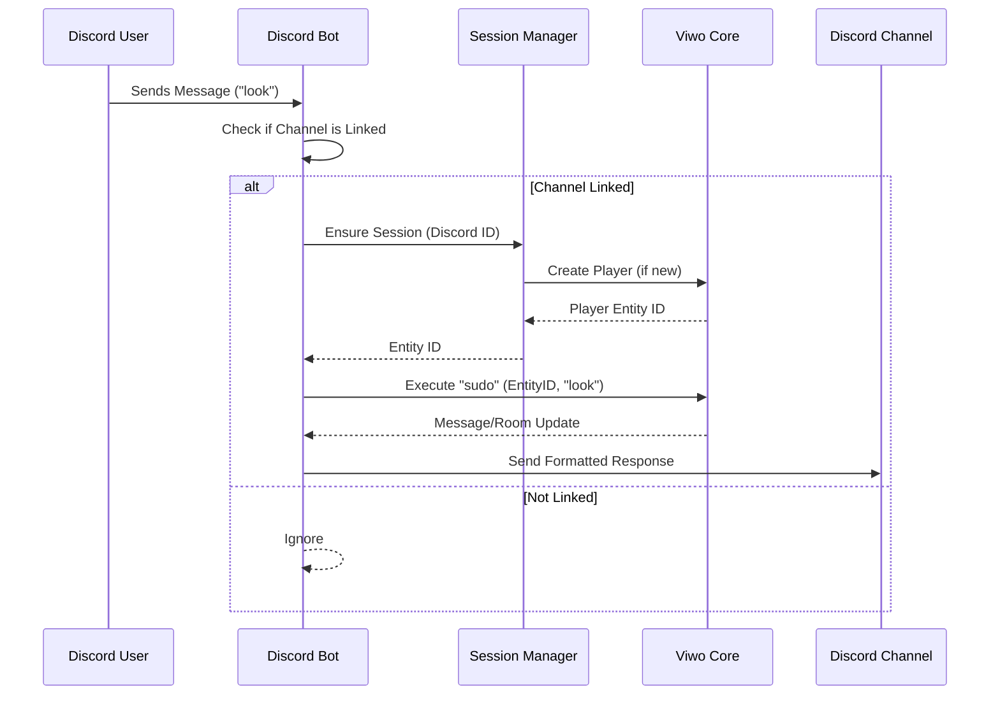

# Discord Bot

The Viwo Discord Bot (`apps/discord-bot`) bridges Discord channels with Viwo rooms, allowing users to interact with the game world directly from Discord.

## Configuration

The bot is configured via environment variables (loaded from `.env`):

- `DISCORD_TOKEN`: The bot token provided by the Discord Developer Portal.
- `CORE_URL`: The WebSocket URL of the Viwo Core server (default: `ws://localhost:8080`).
- `DB_PATH`: Path to the SQLite database file used for storing mappings (default: `bot.sqlite`).
- `BOT_ENTITY_ID`: The ID of the entity representing the bot itself in the game (default: `4`).

## Architecture

The bot is built using `discord.js` and connects to the Viwo Core via a WebSocket connection. It maintains a mapping between Discord channels and game rooms, as well as between Discord users and game entities.

### Key Components

- **`DiscordBot`**: Manages the Discord client, listeners, and message handling.
- **`SessionManager` (`src/session.ts`)**: Maps Discord User IDs to Viwo Entity IDs. It ensures every Discord user has a corresponding player entity in the game.
- **`SocketManager` (`src/socket.ts`)**: Handles the WebSocket connection to the Core. It uses a single connection for the bot but facilitates "sudo" commands to execute actions on behalf of other users.
- **`DatabaseManager` (`src/db.ts`)**: Handles persistence using `bun:sqlite`. It stores channel maps, user defaults, and active sessions.

### Message Flow

When a user sends a message in a linked Discord channel, the following process occurs:

1.  **Discord -> Core**:

    - User types a message.
    - Bot resolves the user to an entity ID via `SessionManager`.
    - Bot sends a `sudo` command to Core: `execute(target_id, verb, args)`.

2.  **Core -> Discord**:
    - Core sends a `forward` message to the Bot's socket.
    - `SocketManager` emits the message.
    - `DiscordBot` receives the message, looks up active sessions for the target entity, and forwards the message to the appropriate Discord channel.



## Commands

- **`!link <room_id>`**: Links the current Discord channel to a specific Viwo room. Messages sent in this channel will be routed to that room.
- **`!ping`**: A simple health check command that replies with "Pong!".
- **`!cmd`**: (Mocked) Slash command handler.

## Session Handling

Sessions are "sticky". Once a Discord user is mapped to a Viwo entity, that mapping persists.

1.  Check active session for `(DiscordID, ChannelID)`.
2.  Check default entity for `DiscordID`.
3.  If neither, create a new Player entity via `create_player` RPC.

## Running Locally

To run the bot locally:

1.  Ensure the Core server is running.
2.  Set up your `.env` file with a valid `DISCORD_TOKEN`.
3.  Run:

    ```bash
    cd apps/discord-bot
    bun run dev
    ```
