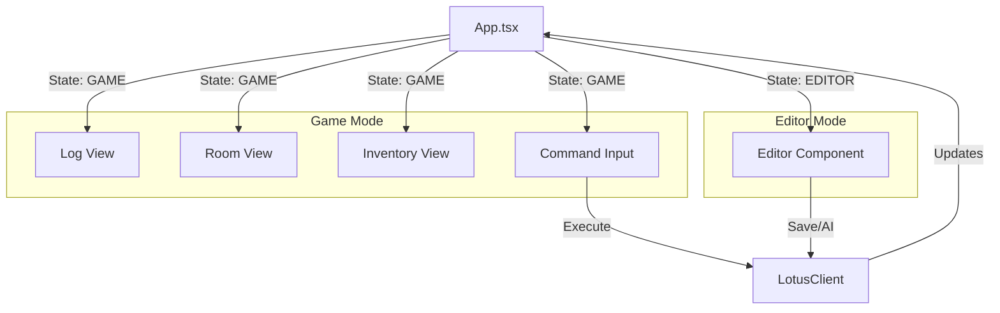

# Terminal User Interface (TUI)

The Lotus TUI is a terminal-based client built with [Ink](https://github.com/vadimdemedes/ink) and React. It provides a rich text interface for playing the game and editing scripts.

## Architecture

The TUI connects to the Lotus Core using the `@lotus/client` library via WebSocket. It maintains a local replica of the game state (entities, messages) to render the UI.

### Key Components

- **`App`**: The root component. Manages connection state, routing (Game vs Editor), and global layout.
- **`Editor`**: A full-screen code editor component for modifying script sources.
- **`LotusClient`**: Handles WebSocket communication, state synchronization, and RPC calls.

## Component Structure

## Features

- **Game Mode**:
  - **Log**: Displays game output and errors.
  - **Room**: Shows the current room name, description, and contents.
  - **Inventory**: Lists items carried by the player.
  - **Input**: Command line for executing verbs (e.g., `look`, `get apple`).
- **Editor Mode**:
  - Triggered by `edit <script_id>`.
  - Provides syntax highlighting (basic) and text editing.
  - **AI Completion**: Integrates with the AI plugin for code suggestions.
  - **Local Completion**: Autocompletes opcodes from the loaded registry.

## State Management

The `App` component syncs with the Core using `client.subscribe()`.

- **`entities`**: Map of all loaded entities.
- **`roomId`**: ID of the room the player is currently in.
- **`playerId`**: ID of the player entity.
