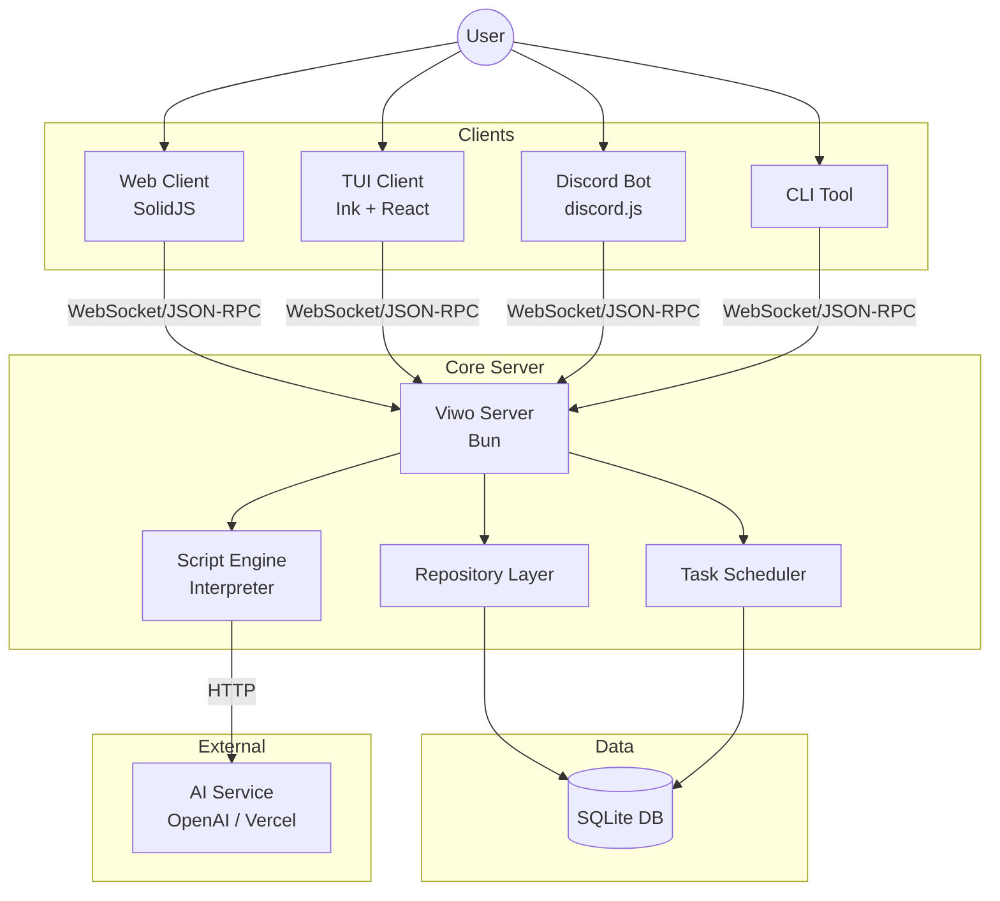
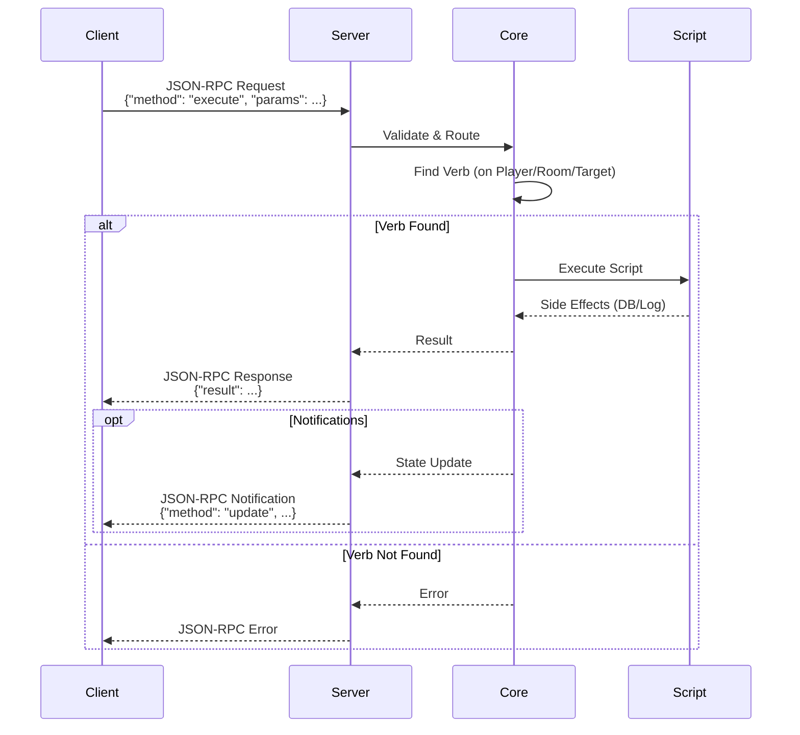

# Viwo Architecture

Viwo is a modern, web-based Multi-User Dungeon (MUD) engine built with TypeScript. It uses a monorepo structure to separate the core game logic, shared definitions, and frontend applications.

## Design Philosophy

Viwo is inspired by ChatMUD and LambdaMOO, focusing on a semantic world state, rich object interactions, and deep AI integration.

## Tech Stack

- **Runtime**: Bun
- **Database**: Bun:SQLite
- **Frontend**: SolidJS (Web), React + Ink (TUI)
- **AI**: Vercel AI SDK / OpenAI

## System Architecture

## High-Level Overview

The system consists of several main parts:

1.  **Core Server (`packages/core`)**: The authoritative game server. It handles the game loop, entity management, scripting, and WebSocket connections.
2.  **Web Client (`apps/web`)**: A **SolidJS**-based frontend that connects to the Core via WebSockets.
3.  **TUI Client (`apps/tui`)**: A text-based UI built with **React + Ink**.
4.  **Discord Bot (`apps/discord-bot`)**: A bridge to play the game via Discord, built with **discord.js**.
5.  **CLI (`apps/cli`)**: A command-line interface for the game, using **minimist** and **chalk**.
6.  **Client SDK (`packages/client`)**: A type-safe TypeScript SDK that handles WebSocket connections, state management, and JSON-RPC communication for all frontends.
7.  **Shared Library (`packages/shared`)**: Contains types, schemas, and utility functions shared between the Core and clients.

## Core Concepts

### Entities

Everything in the game world is an **Entity**. Entities are stored in a SQLite database and loaded into memory.

- **Schema**: `id` (integer), `prototype_id` (integer, nullable), `props` (JSON).
- **Props**: Entities have a JSON `props` field for flexible data storage (e.g., `name`, `description`, `location`, `contents`).
- **Inheritance**: Objects can inherit properties and verbs from parent objects (Prototypes). Resolution is recursive.

### Scripting

Viwo features a custom scripting language (Lisp-like S-expressions) for dynamic game logic.

- **Verbs**: Scripts attached to entities that define actions (e.g., `push`, `open`).
- **Interpreter**: A secure sandbox that executes scripts with access to game primitives.
- **Context**: `ScriptContext` directly includes a `send` function for communication.
- **Libraries**: Modular libraries (`core`, `list`, `object`, `string`, `time`) provide functionality, decoupled from the core interpreter.

### Security

Viwo uses a **Capability-Based Security** model. Permissions are handled via unforgeable tokens called Capabilities, rather than user roles. See [Security](./security.md) for details.

## AI Integration

- **Text Generation**: For NPC dialogue, room descriptions, and dynamic responses.
- **Image Generation**: For character avatars and item icons.

## Data Flow (JSON-RPC 2.0)

Communication between Client and Server uses the JSON-RPC 2.0 protocol.

1.  **Request**: Client sends a JSON-RPC request (e.g., `execute` command).
2.  **Processing**:
    - **Validation**: Core validates the request.
    - **Verb Search**: Core looks for a matching "verb" on the player, room, or target objects.
    - **Execution**: If a verb is found, the script is executed.
3.  **Notifications**: Server sends JSON-RPC notifications to clients:
    - `message`: Text output (info/error).
    - `update`: Entity state updates (normalized list of entities).
    - `update`: Entity state updates (normalized list of entities).
    - `player_id` / `room_id`: Context updates.

## Directory Structure

- `apps/`
  - `web/`: The SolidJS frontend.
  - `tui/`: The React + Ink terminal UI.
  - `discord-bot/`: The Discord integration.
  - `cli/`: The command-line interface.
  - `server/`: Entry point for the standalone server.
- `packages/`
  - `core/`: The game server logic.
  - `client/`: The client SDK.
  - `shared/`: Shared types and schemas.
- `plugins/`
  - `ai/`: AI integration plugin.

## Testing Strategy

- **In-Memory Database**: Tests use an in-memory SQLite database (`:memory:`) seeded with initial data to ensure isolation and speed.
- **Mocking**: We avoid `spyOn` for `global.localStorage` where possible, preferring dependency injection or cleaner mocks.
