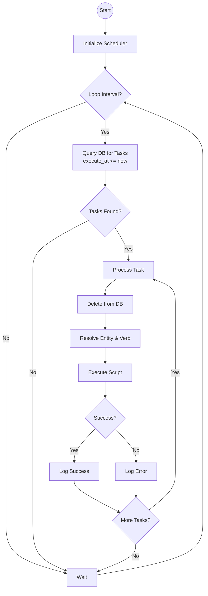

# Scheduler

The **Scheduler** component in Lotus is responsible for managing and executing delayed tasks. It allows scripts to schedule verbs to be executed on entities at a future time.

## Overview

The `TaskScheduler` class handles the scheduling loop. It persists tasks in the SQLite database to ensure they survive server restarts.

### Key Features

- **Persistence**: Tasks are stored in the `scheduled_tasks` table.
- **Precision**: Tasks are checked at a configurable interval (default: 1000ms).
- **Context**: Executed tasks run within a full `ScriptContext`, including a `send` function for communicating with clients.

## Usage

### Scheduling a Task

Tasks are typically scheduled via the scripting API (e.g., a `schedule` opcode, though the opcode implementation delegates to this class).

```typescript
import { scheduler } from "./scheduler";

// Schedule 'my_verb' to run on entity 123 in 5 seconds
scheduler.schedule(123, "my_verb", ["arg1", "arg2"], 5000);
```

### Processing Tasks

The scheduler must be started to process tasks. It runs a loop that queries the database for tasks where `execute_at <= now`.

```typescript
scheduler.start(1000); // Check every 1 second
```

When a task is processed:

1. It is retrieved from the database.
2. It is immediately **deleted** from the database to prevent double-execution.
3. The target entity and verb are resolved.
4. The verb is executed using the `evaluate` function from `@lotus/scripting`.

### Send Factory

To allow scheduled scripts to send messages to clients (who might not be the original caller), the scheduler requires a `sendFactory`. This factory produces a `send` function for a given entity ID.

```typescript
scheduler.setSendFactory((entityId) => (type, payload) => {
  // Logic to send message to the client controlling entityId
});
```

## Database Schema

The scheduler relies on the `scheduled_tasks` table:

| Column       | Type    | Description                             |
| :----------- | :------ | :-------------------------------------- |
| `id`         | INTEGER | Primary Key                             |
| `entity_id`  | INTEGER | ID of the entity to execute the verb on |
| `verb`       | TEXT    | Name of the verb to execute             |
| `args`       | TEXT    | JSON stringified arguments list         |
| `execute_at` | INTEGER | Timestamp (ms) when the task should run |

## Error Handling

If a task fails to execute (e.g., entity not found, script error), the error is caught and logged to `console.error`. The task remains deleted from the database to prevent a crash loop.

### Scheduler Logic


