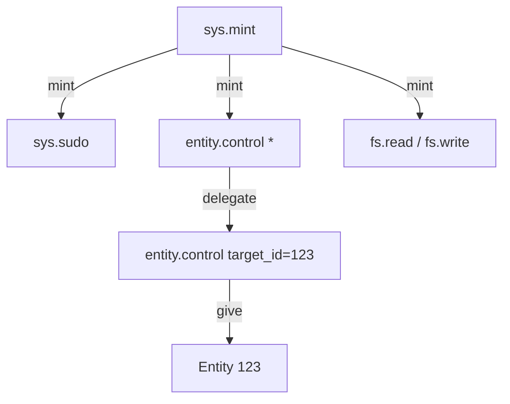

# Capability-Based Security

Lotus uses a **Capability-Based Security** model to manage permissions and access control. Unlike Access Control Lists (ACLs) which check _who_ you are, capabilities check _what you possess_.

## Concept

A **Capability** is an unforgeable token that grants authority to perform a specific action. In Lotus, capabilities are first-class objects in the scripting language, represented as opaque handles.

- **Unforgeable**: Scripts cannot create capabilities from thin air. They must be granted by the kernel or another entity.
- **Delegatable**: A script holding a capability can pass it to another entity or create a restricted version (delegation).
- **Granular**: Capabilities can carry parameters (e.g., "read access to /tmp/\*") to fine-tune permissions.

## Structure

A capability consists of:

- **ID**: A unique UUID.
- **Owner**: The entity ID that currently possesses the capability.
- **Type**: A string identifier (e.g., `sys.mint`, `fs.read`).
- **Params**: A JSON object containing specific constraints (e.g., `{ "path": "/home/user" }`).

## Capability Hierarchy

Capabilities form a hierarchy of trust, rooted in the kernel.

### The Root: `sys.mint`

The `sys.mint` capability is the "Root of Trust". It allows the holder to create _any_ other capability.

- **Held by**: The Kernel (ID 0) and the System entity (ID 3).
- **Power**: Infinite. Can mint `sys.sudo`, `entity.control` (wildcard), or any subsystem capability.

### Hierarchy Diagram



### Administrative vs. Impersonation Power

It is important to distinguish between "Root" administrative power and "Sudo" impersonation power.

| Capability       | Params          | Power                                                                                                                                                    | Analogy                |
| :--------------- | :-------------- | :------------------------------------------------------------------------------------------------------------------------------------------------------- | :--------------------- |
| `entity.control` | `{ "*": true }` | **Administrative**. Can destroy, modify, or hijack _any_ entity, regardless of its internal logic. Bypasses all ownership checks.                        | `rm -rf /` (Root)      |
| `sys.sudo`       | `(none)`        | **Impersonation**. Can execute _existing verbs_ on an entity as if the caller were that entity. Limited by what the entity is actually capable of doing. | `sudo -u user command` |

**Why `*` exists**: Without a wildcard `entity.control`, an administrator could not delete a buggy or malicious entity that has no `delete` verb or has broken its own logic. `sys.sudo` would fail in that case because there is no valid code to execute on the target.

## Kernel Opcodes

The kernel provides low-level opcodes to manage capabilities:

- **`mint(authority, type, params)`**: Creates a new capability. Requires a `sys.mint` capability as authority.
- **`delegate(parent, restrictions)`**: Creates a new capability derived from a parent capability, potentially with tighter restrictions.
- **`give_capability(cap, target)`**: Transfers ownership of a capability to another entity.
- **`get_capability(type, filter)`**: Retrieves a capability owned by the current entity.

## Root Capabilities

The system is bootstrapped with several root capabilities:

- **`sys.mint`**: The ultimate authority. Allows minting new capabilities.
  - **Params**: `{ "namespace": "string" }`
  - **Usage**: `namespace` can be a specific prefix (e.g., `"user.123"`) or `"*"` for full authority.
- **`sys.create`**: Allows creating new entities.
  - **Params**: None (currently).
- **`sys.sudo`**: Allows impersonating other entities (executing code as them).
  - **Params**: None (currently).
- **`entity.control`**: Grants control over a specific entity (update props, delete, set prototype).
  - **Params**: `{ "target_id": number }` or `{ "*": true }`
  - **Usage**: `target_id` restricts control to a single entity. `"*": true` grants control over ALL entities (superuser/admin permissions).

## Subsystems

### File System (`fs`)

File system access is guarded by `fs.read` and `fs.write` capabilities.

- **Type**: `fs.read` / `fs.write`
- **Params**: `{ "path": "/allowed/path" }`
- **Check**: The system checks if the requested path is within the allowed path.

### Network (`net`)

Network access is guarded by `net.http.read` and `net.http.write`.

- **Type**: `net.http.read` (GET) / `net.http.write` (POST)
- **Params**: `{ "domain": "example.com" }`
- **Check**: The system checks if the requested URL's hostname matches or ends with the allowed domain.

## Example Usage

```typescript
// Mint a capability to read /tmp
const root = get_capability("sys.mint");
const readCap = mint(root, "fs.read", { path: "/tmp" });

// Use it to read a file
const content = fs.read(readCap, "/tmp/hello.txt");

// Give it to another entity
give_capability(readCap, someOtherEntity);
```

## Capability Namespacing

To prevent capability collisions and unauthorized minting, the `sys.mint` capability enforces namespacing.

- **Namespace Parameter**: The `sys.mint` capability has a `namespace` parameter (e.g., `"user.123"`).
- **Minting Restriction**: When minting a new capability, its type string _must_ start with the authority's namespace.
  - Authority: `sys.mint` with `{ "namespace": "user.123" }`
  - Allowed: `user.123.storage`, `user.123.game.score`
  - Denied: `sys.sudo`, `fs.read`, `user.456.storage`

### User Namespaces

Users are typically granted a `sys.mint` capability restricted to their own namespace (e.g., `user.<id>`). This allows them to create custom capabilities for their own scripts and games without risking system stability.

## Design Decisions

### Why `entity.control` Wildcard?

You might wonder why we use a wildcard parameter (`{ "*": true }`) on `entity.control` instead of a separate `sys.admin` capability.

**Rationale**:

1.  **Unified Interface**: All entity management operations (`set_entity`, `destroy`, `set_prototype`) check for `entity.control`. By using a wildcard, we allow administrators to use the exact same tools and opcodes as regular owners. A separate capability would require every opcode to check for _two_ types (`entity.control` OR `sys.admin`), increasing complexity and potential bugs.
2.  **Simplicity**: It keeps the number of core capability types low.
3.  **Explicit Power**: The `*` explicitly denotes "control over everything", which is semantically clear in the context of a capability system.

**Trade-offs**:

- It overloads the semantic meaning of the capability (specific vs global).
- It requires careful handling in the kernel to ensure the wildcard is checked correctly (and not accidentally granted).

### Why `entity.` Namespace?

Currently, `entity.control` is the only capability in the `entity` namespace. You might ask if the namespace is necessary.

**Rationale**:

- **Consistency**: It follows the system-wide `category.action` pattern (e.g., `fs.read`, `net.http.write`, `sys.mint`).
- **Future-proofing**: We may add other entity-related capabilities in the future, such as `entity.listen` (to eavesdrop on messages) or `entity.transfer` (if we separate ownership transfer from control).
- **Clarity**: `control` alone is vague. `entity.control` explicitly states _what_ is being controlled.

### Sharing Access

Since there is no `can_edit` verb or `permissions` property, sharing access to an entity requires **delegating** a capability.

1.  **Owner** holds `entity.control` for their entity.
2.  **Owner** calls `delegate` to create a restricted capability (e.g., specific to that entity).
3.  **Owner** calls `give_capability` to transfer the new capability to another user.

### Checking Capabilities

To check if an entity has a specific capability, use the `has_capability` kernel opcode. This is useful for verbs that need to verify permissions before performing an action.

```typescript
// Check if the caller has control over the target entity
if (Kernel.has_capability(caller, "entity.control", { target_id: target.id })) {
  // Allow action
} else {
  // Deny action
}
```

You can also check for wildcard capabilities:

```typescript
// Check if the caller has root control
if (Kernel.has_capability(caller, "entity.control", { "*": true })) {
  // Allow root action
}
```

### Plugin Capabilities

Plugins can define their own capabilities using the `sys.mint` namespacing feature.

- **Pattern**: `plugin.<name>.<action>`
- **Example**: An AI plugin might need a capability to generate text.
  1.  System mints `sys.mint` with `{ "namespace": "plugin.ai" }`.
  2.  Plugin uses this authority to mint `plugin.ai.generate` for specific users or entities.
