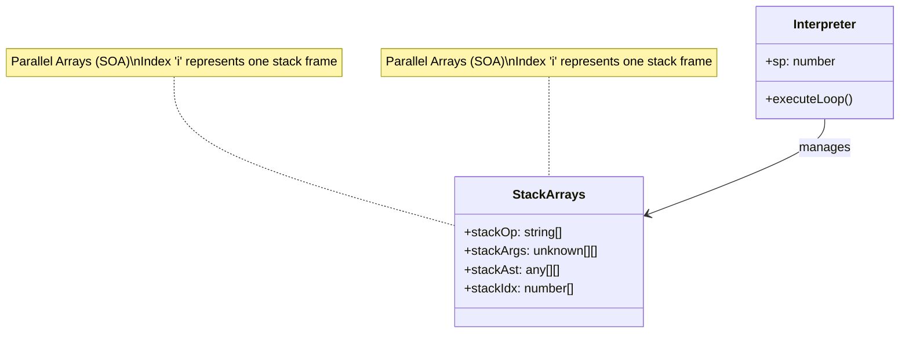

# Reed Interpreter

The Reed interpreter is a stack-based virtual machine designed for executing Reed S-expressions. It uses a Structure of Arrays (SOA) layout for its execution stack to optimize for cache locality and reduce garbage collection overhead.

## Architecture

Unlike traditional interpreters that might use recursion or an array of objects for stack frames, the Reed interpreter manages its execution state using parallel arrays. This "Structure of Arrays" (SOA) approach means that instead of having a single `StackFrame` object containing all data for a call, the data is split across multiple typed arrays.

This design allows the interpreter to:

- **Reuse Arrays**: Argument arrays are pooled and reused, significantly reducing memory allocation during execution.
- **Improve Locality**: Accessing related data (like opcodes) is more cache-friendly as they are stored contiguously.

## Stack Layout

The execution stack is composed of several parallel arrays, indexed by a stack pointer (`sp`).

- **`stackOp: string[]`**: Stores the opcode for the current frame.
- **`stackArgs: unknown[][]`**: Stores the evaluated arguments for the current frame. These arrays are reused to minimize GC pressure.
- **`stackAst: any[][]`**: Stores the raw AST (S-expression) being evaluated.
- **`stackIdx: number[]`**: Stores the current index within the AST, tracking which argument is currently being processed.

### Stack Visualization



## Scope Management

The interpreter uses a **prototype chain** mechanism to handle block scoping efficiently.

- **Scope Chain**: Each scope is an object that inherits from its parent scope using `Object.create(parentScope)`. This allows variable lookups to naturally traverse up the chain (shadowing works automatically).
- **Copy-On-Write (COW)**: To avoid creating new objects for every instruction that might need a scope (like `seq`), the interpreter uses a `cow` flag in the `ScriptContext`.
  - When entering a potential new scope (e.g., `seq`), `cow` is set to `true`.
  - If a variable is defined (`let`), the scope is "forked" (a new object is created inheriting from the current one) only if `cow` is true, and `cow` is reset to `false`.
  - If no variables are defined, the scope remains shared, avoiding allocation overhead.

## Usage

The primary entry point for the interpreter is the `evaluate` function.

```typescript
import { evaluate, createScriptContext } from "@lotus/scripting";

const script = ["seq", ["log", "Hello"], ["+", 1, 2]];
const ctx = createScriptContext({
  // ... context setup
});

const result = await evaluate(script, ctx);
```

### Async Behavior

The `evaluate` function exhibits **inconsistent async behavior** for performance reasons. It does not wrap everything in a Promise.

- **Synchronous Execution**: If all opcodes in the script are synchronous, `evaluate` returns the result **synchronously**.
- **Asynchronous Execution**: If any opcode returns a Promise, `evaluate` returns a Promise that resolves to the result.
- **Error Handling**:
  - If a synchronous opcode throws an error, `evaluate` **throws synchronously**.
  - If an asynchronous opcode rejects, `evaluate` returns a **rejected Promise**.

> [!IMPORTANT]
> When testing or calling `evaluate` from an async context, you should wrap it to handle both cases safely, or ensure you `await` the result if you expect async operations.
>
> ```typescript
> // Safe handling for tests
> await expect(
>   Promise.resolve().then(() => evaluate(script, ctx)),
> ).rejects.toThrow();
> ```

### ScriptContext

The `ScriptContext` holds the environment for the script execution, including:

- **`vars`**: Local variables.
- **`args`**: Arguments passed to the script.
- **`this`**: The entity the script is executing on.
- **`caller`**: The entity that called the script.
- **`gas`**: Execution limit to prevent infinite loops.
