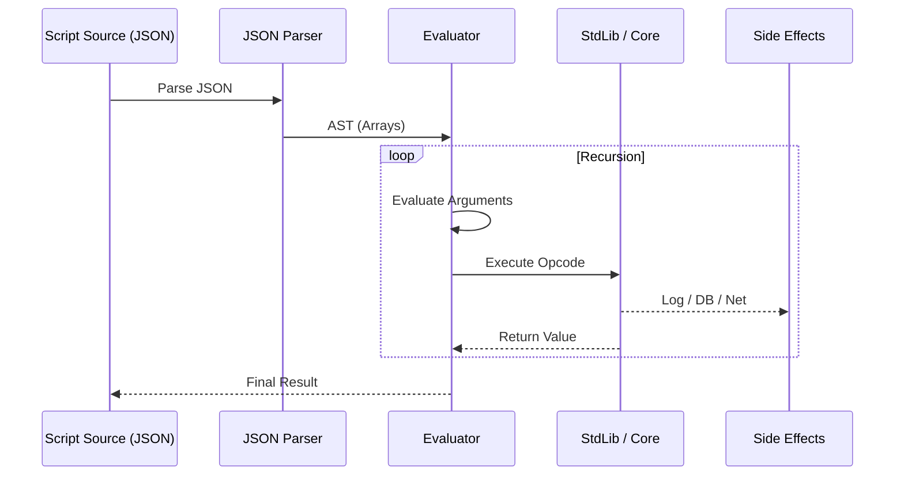

# Scripting Language Specification

The Lotus scripting language is a dynamic, JSON-based language that uses S-expressions (Lisp-like syntax) represented as JSON arrays. It is designed to be embedded in JSON documents and executed by the Lotus core engine.

## Core Syntax

Scripts are represented as JSON arrays where the first element is the opcode (a string) and the subsequent elements are arguments. Arguments can be literals (numbers, strings, booleans, null), other S-expressions (nested arrays), or variable references.

Example:

```json
[
  "seq",
  ["log", "Hello World"],
  ["let", "x", 10],
  ["if", [">", ["var", "x"], 5], ["log", "x is greater than 5"], ["log", "x is small"]]
]
```

### Evaluation

- **Literals**: Numbers, strings, booleans, and null evaluate to themselves.
- **Arrays**: The first element is treated as the opcode. If the opcode is registered, the function is executed with the evaluated arguments (unless the opcode is a special form like `if` or `let` which might handle evaluation differently).
- **Unknown Opcodes**: If an array starts with a string that is not a known opcode, a `ScriptError` is thrown.

### Execution Flow



## Std Library

_Defined in: `packages/scripting/src/lib/std.ts`_

The standard library provides essential control flow, variable management, and system interaction tools.

### Context

- `["this"]`: The `Entity` the script is attached to (`ctx.this`).
- `["caller"]`: The `Entity` executing the script (`ctx.caller`).

### Control Flow

- `["seq", ...steps]`: Executes steps in sequence. Returns the result of the last step.
- `["if", cond, then, else?]`: Conditional execution.
- `["while", cond, body]`: Repeats body while condition is true.
- `["for", varName, list, body]`: Iterates over a list.
- `["try", tryBlock, errorVar?, catchBlock?]`: Exception handling.
- `["throw", msg]`: Throws an error.

### Variables

- `["let", name, value]`: Defines a variable in the current **block** scope. If a variable with the same name exists in an outer scope, it is shadowed.
- `["var", name]`: Retrieves a variable's value from the current scope or nearest outer scope.
- `["set", name, value]`: Updates an existing variable in the current or nearest outer scope. If the variable does not exist, it throws an error.

### Scoping

LotusScript uses **lexical block scoping**. A new scope is created for:

- `seq` (Sequence)
- `if` (Then and Else branches)
- `while` (Loop body)
- `for` (Loop body)
- `try` (Try and Catch blocks)
- `lambda` (Function body)

Variables declared with `let` are only accessible within the block they are defined in and its sub-blocks.

### System & Debugging

- `["log", ...msgs]`: Logs messages to the server console.
- `["warn", msg]`: Adds a warning to the context.
- `["send", type, payload]`: Sends a system message (notification) to the caller.
- `["arg", index]`: Gets a script argument by index.
- `["args"]`: Gets all script arguments.
- `["typeof", value]`: Returns the type of the value ("string", "number", "boolean", "object", "null", "array").
- `["quote", value]`: Returns the value unevaluated.

### Functions & Calls

- `["lambda", [argNames], body]`: Creates a lambda function.
- `["apply", func, ...args]`: Calls a lambda function.

### Data Structures

- `["json.stringify", value]`: Converts value to JSON string.
- `["json.parse", string]`: Parses JSON string.

## Math Library

_Defined in: `packages/scripting/src/lib/math.ts`_

- `["+", a, b, ...]`: Addition.
- `["-", a, b, ...]`: Subtraction.
- `["*", a, b, ...]`: Multiplication.
- `["/", a, b, ...]`: Division.
- `["%", a, b]`: Modulo.
- `["^", a, b, ...]`: Exponentiation.
- `["random", min?, max?]`: Generates a random number.

## Boolean Library

_Defined in: `packages/scripting/src/lib/boolean.ts`_

All comparison operators support chaining (e.g., `["<", 1, 2, 3]` checks `1 < 2` AND `2 < 3`).

- `["==", a, b, ...]`: Equality check.
- `["!=", a, b, ...]`: Inequality check.
- `["<", a, b, ...]`: Less than.
- `[">", a, b, ...]`: Greater than.
- `["<=", a, b, ...]`: Less than or equal.
- `[">=", a, b, ...]`: Greater than or equal.
- `["and", ...args]`: Logical AND. Returns `true` if all arguments are true, `false` otherwise.
- `["or", ...args]`: Logical OR. Returns `true` if at least one argument is true, `false` otherwise.
- `["not", arg]`: Logical NOT. Returns the opposite boolean value.
- `["guard", ...args]`: Short-circuiting AND. Returns the first falsy value or the last value. Similar to JavaScript's `&&` operator.
- `["nullish", ...args]`: Nullish coalescing. Returns the first non-null/undefined value. Similar to JavaScript's `??` operator.

## Core Library (DB & Entity)

_Defined in: `packages/core/src/runtime/lib/core.ts`_

The core library provides interaction with the game world, database, and entities.

### Entity Interaction

- `["create", data]`: Creates a new entity. `data` is an object with props. Returns the new ID.
- `["destroy", target]`: Destroys an entity.
- `["entity", id]`: Gets an entity by ID.
- `["set_entity", ...entities]`: Transactional update of properties for one or more entities.
- `["get_prototype", entity]`: Gets the prototype ID of an entity.
- `["set_prototype", entity, protoId]`: Sets the prototype ID of an entity.
- `["resolve_props", entity]`: Returns an entity with all properties resolved (merged with prototype).
- `["verbs", entity]`: Gets a list of verbs available on an entity.
- `["get_verb", entity, name]`: Gets a specific verb from an entity.

### Calls & Scheduling

- `["call", target, verb, ...args]`: Calls a verb on an entity.
- `["schedule", verb, args, delay]`: Schedules a verb call on `this` entity after `delay` milliseconds.
- `["sudo", target, verb, args]`: Executes a verb as another entity (System/Bot only).
- `["get_capability", type, filter?]`: Retrieves a capability.
- `["mint", authority, type, params]`: Mints a new capability.
- `["delegate", parent, restrictions]`: Delegates a capability.
- `["give_capability", cap, target]`: Transfers a capability.

### File System Library

_Defined in: `packages/core/src/runtime/lib/fs.ts`_

- `["fs.read", cap, path]`: Reads a file.
- `["fs.write", cap, path, content]`: Writes to a file.
- `["fs.list", cap, path]`: Lists directory contents.

### Network Library

_Defined in: `packages/core/src/runtime/lib/net.ts`_

- `["net.http.get", cap, url]`: Performs an HTTP GET request.
- `["net.http.post", cap, url, body]`: Performs an HTTP POST request.

## List Library

_Defined in: `packages/scripting/src/lib/list.ts`_

- `["list.new", ...items]`: Creates a list.
- `["list.len", list]`: Returns the length of a list.
- `["list.empty", list]`: Checks if a list is empty.
- `["list.get", list, index]`: Gets an item at an index.
- `["list.set", list, index, value]`: Sets an item at an index.
- `["list.push", list, value]`: Adds an item to the end.
- `["list.pop", list]`: Removes and returns the last item.
- `["list.unshift", list, value]`: Adds an item to the beginning.
- `["list.shift", list]`: Removes and returns the first item.
- `["list.slice", list, start, end?]`: Returns a sub-list.
- `["list.splice", list, start, deleteCount, ...items]`: Modifies a list.
- `["list.concat", list1, list2]`: Concatenates two lists.
- `["list.includes", list, value]`: Checks if a value exists in the list.
- `["list.reverse", list]`: Reverses the list.
- `["list.sort", list]`: Sorts the list.
- `["list.join", list, sep]`: Joins list elements into a string.
- `["list.find", list, func]`: Finds an element using a predicate.
- `["list.map", list, func]`: Maps a function over the list.
- `["list.filter", list, func]`: Filters the list using a predicate.
- `["list.reduce", list, func, init]`: Reduces the list.
- `["list.flatMap", list, func]`: Maps and flattens the list.

## Object Library

_Defined in: `packages/scripting/src/lib/object.ts`_

- `["obj.new", [key1, val1], [key2, val2], ...]`: Creates an object from key-value pairs.
- `["obj.keys", obj]`: Returns keys.
- `["obj.values", obj]`: Returns values.
- `["obj.entries", obj]`: Returns entries.
- `["obj.get", obj, key]`: Gets a value.
- `["obj.set", obj, key, value]`: Sets a value.
- `["obj.has", obj, key]`: Checks if a key exists.
- `["obj.del", obj, key]`: Deletes a key.
- `["obj.merge", ...objs]`: Merges objects.
- `["obj.map", obj, func]`: Maps values.
- `["obj.filter", obj, func]`: Filters entries.
- `["obj.reduce", obj, func, init]`: Reduces entries.
- `["obj.flatMap", obj, func]`: Maps and flattens.

## String Library

_Defined in: `packages/scripting/src/lib/string.ts`_

- `["str.len", str]`: Returns length.
- `["str.concat", ...strs]`: Concatenates strings.
- `["str.split", str, sep]`: Splits a string.
- `["str.slice", str, start, end?]`: Returns a substring.
- `["str.upper", str]`: Converts to uppercase.
- `["str.lower", str]`: Converts to lowercase.
- `["str.trim", str]`: Trims whitespace.
- `["str.replace", str, search, replace]`: Replaces a substring.
- `["str.includes", str, search]`: Checks if substring exists.
- `["str.join", list, sep]`: Joins a list of strings.

## Time Library

_Defined in: `packages/scripting/src/lib/time.ts`_

- `["time.now"]`: Returns current ISO timestamp.
- `["time.format", timestamp]`: Formats a timestamp.
- `["time.parse", datetime]`: Parses a datetime string.
- `["time.from_timestamp", number]`: Converts number to ISO string.
- `["time.to_timestamp", datetime]`: Converts ISO string to number.
- `["time.offset", amount, unit, base?]`: Adds an offset to a date.

## Practical Examples

This section demonstrates common patterns and real-world usage of LotusScript opcodes.

### Default Values with Nullish Coalescing

Use `nullish` to provide default values when a variable might be `null` or `undefined`:

```json
["let", "theme", ["nullish", ["arg", 0], "modern"]]
```

This sets `theme` to the first argument if provided, otherwise defaults to `"modern"`.

### Conditional Execution with Guard

Use `guard` for conditional execution that short-circuits on falsy values:

```json
[
  "guard",
  ["get_capability", "fs.write", ["obj.new", ["path", "/data"]]],
  ["fs.write", ["var", "cap"], "/data/config.json", ["var", "content"]]
]
```

This only executes the `fs.write` if the capability is successfully retrieved.

### Chained Comparisons

Comparison operators support chaining for readable range checks:

```json
[
  "if",
  ["<", 0, ["var", "health"], 100],
  ["log", "Health is in valid range"],
  ["log", "Health is out of bounds"]
]
```

This checks if `0 < health < 100` in a single expression.

### Working with Capabilities

Getting a capability and using it safely:

```json
[
  "seq",
  ["let", "httpCap", ["get_capability", "net.http", ["obj.new", ["domain", "api.example.com"]]]],
  [
    "if",
    ["var", "httpCap"],
    [
      "seq",
      [
        "let",
        "response",
        ["net.http.fetch", ["var", "httpCap"], "https://api.example.com/data", ["obj.new"]]
      ],
      ["let", "data", ["net.http.response_json", ["var", "response"]]],
      ["log", "Fetched data:", ["var", "data"]]
    ],
    ["warn", "Missing net.http capability"]
  ]
]
```

### Iteration with List Operations

Mapping over a list with a lambda function:

```json
["let", "numbers", ["list.new", 1, 2, 3, 4, 5]],
["let", "doubled",
  ["list.map", ["var", "numbers"],
    ["lambda", ["n"], ["*", ["var", "n"], 2]]
  ]
]
```

### Error Handling

Using `try` for safe operations:

```json
[
  "try",
  [
    "seq",
    ["let", "data", ["json.parse", ["var", "jsonString"]]],
    ["log", "Parsed successfully:", ["var", "data"]]
  ],
  "error",
  ["log", "Failed to parse JSON:", ["var", "error"]]
]
```

## Permissions

Lotus uses a **Capability-Based Security** model. See [Security](../core/security.md) for details.

To check if an actor can edit an entity, the system checks for `entity.control` capability.
