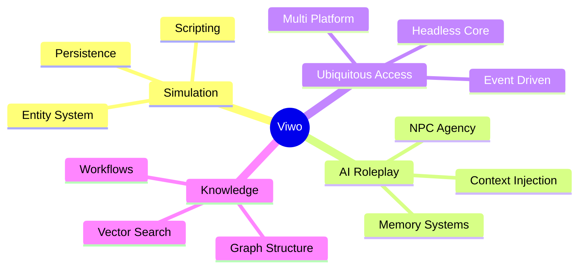

# Viwo Vision

Viwo is designed as a **Scriptable Object Server**. While its roots are in MUDs, its architecture—a persistent graph of objects with attached logic—is generic enough to power games, knowledge bases, and productivity tools.

Our vision is built on four converging pillars:

## 1. Deep Simulation (The "Sandbox" Pillar)

_Inspired by: ChatMUD, LambdaMOO, Corruption of Champions, Lilith's Throne, Dwarf Fortress, Paradise, Universe_

Viwo supports complex, stat-heavy simulations and malleable, programmable worlds where the world state is as important as the narrative.

### How it fits

- **Entity System**: The flexible `props` JSON store allows for infinite extensibility of character stats, inventories, and status effects without schema migrations.
- **Scripting**: The secure, sandboxed scripting language allows for complex game logic (combat calculations, transformation events, economy simulations) to be executed safely on the server.
- **Persistence**: The SQLite backing ensures that every change is permanent.

## 2. AI-Native Roleplay (The "SillyTavern" Pillar)

_Inspired by: SillyTavern, Talemate, Character.AI, Façade_

Viwo acts as a context engine for LLMs, providing the "grounding" that pure chatbots lack.

### How it fits

- **Context Injection**: The engine provides the LLM with the current world state (location, inventory, nearby actors) to prevent hallucinations.
- **NPC Agency**: AI agents are Entities that can use Verbs, allowing them to interact with the world physically, not just verbally.

### Future Work

- **Memory Systems**: Vector database integration for long-term memory of past conversations.
- **Streaming**: Real-time token streaming for immersive "typing" effects.
- **Director AI**: A meta-AI that manages pacing, spawns enemies, or alters the environment to drive the story.
- **Dynamic State Context**: Moving beyond linear chat logs and static "Lorebooks". Context is derived from the live simulation state—mutable personality traits, ephemeral emotions, and conditional stats that evolve with every interaction.

## 3. Ubiquitous Access (The "Chatbot" Pillar)

_Inspired by: Discord Bots, Slack Apps, Telegram Games_

The system is headless and API-first, allowing interaction from any platform.

### How it fits

- **Headless Core**: The server speaks pure JSON-RPC, decoupling logic from presentation.
- **Event-Driven**: Supports pushing events to passive clients (like Discord channels).

## 4. Knowledge & Productivity (The "Notion" Pillar)

_Inspired by: Obsidian, Notion, Trello_

Viwo can function as a "Second Brain" or a programmable workspace. The same primitives that define a "Room" and "Items" can define a "Kanban Board" and "Cards".

### How it fits

- **Graph Structure**: Entities are nodes in a graph. Links between notes are just entity references.
- **Vector Search**: The plugin architecture allows integrating vector stores (like `sqlite-vec`) for semantic search over your notes/entities.
- **Programmable Workflows**: Scripts can automate your productivity.
  - _Example_: A "Done" column in a Kanban board that automatically archives cards placed in it.
  - _Example_: A "Daily Note" that automatically pulls in calendar events from an external API.

### Future Work

- **Vector Plugin**: Integration with `sqlite-vec` for semantic search.
- **Graph Queries**: Standard library functions for traversing entity relationships (backlinks, children, parents).
- **Specialized Frontends**: Because Viwo is frontend-agnostic, we can build entirely new, purpose-built clients (e.g., a dedicated Kanban Board app, a Graph Explorer, or a Calendar view) that all interact with the same shared world state.
- **Wiki Features**: First-class support for bi-directional linking, revision history, and transclusion.
- **Performance**: Support for custom database views and indexes to optimize specific query patterns (e.g., deep graph traversals).
